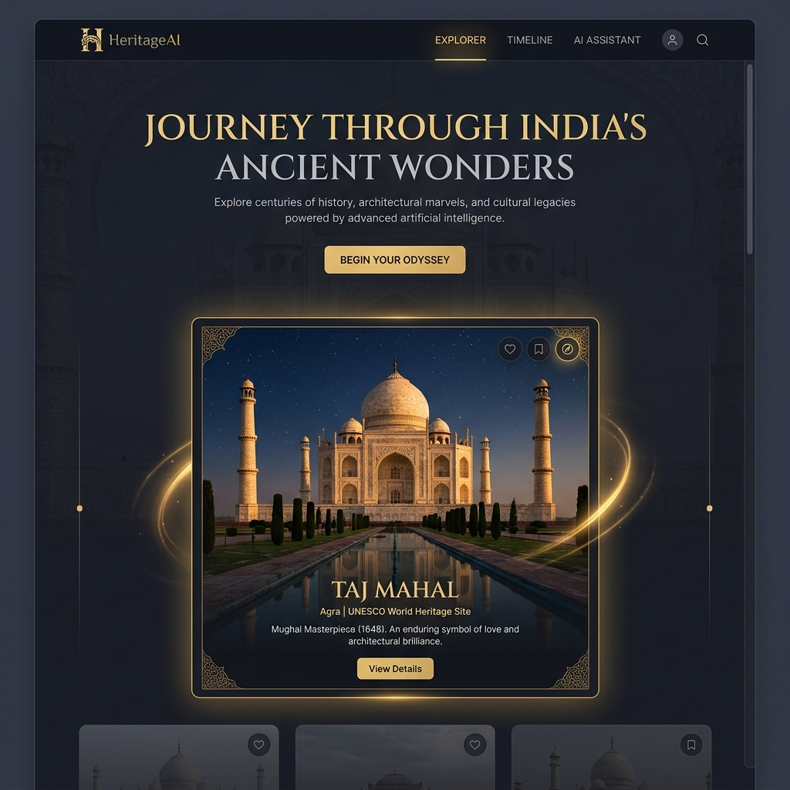
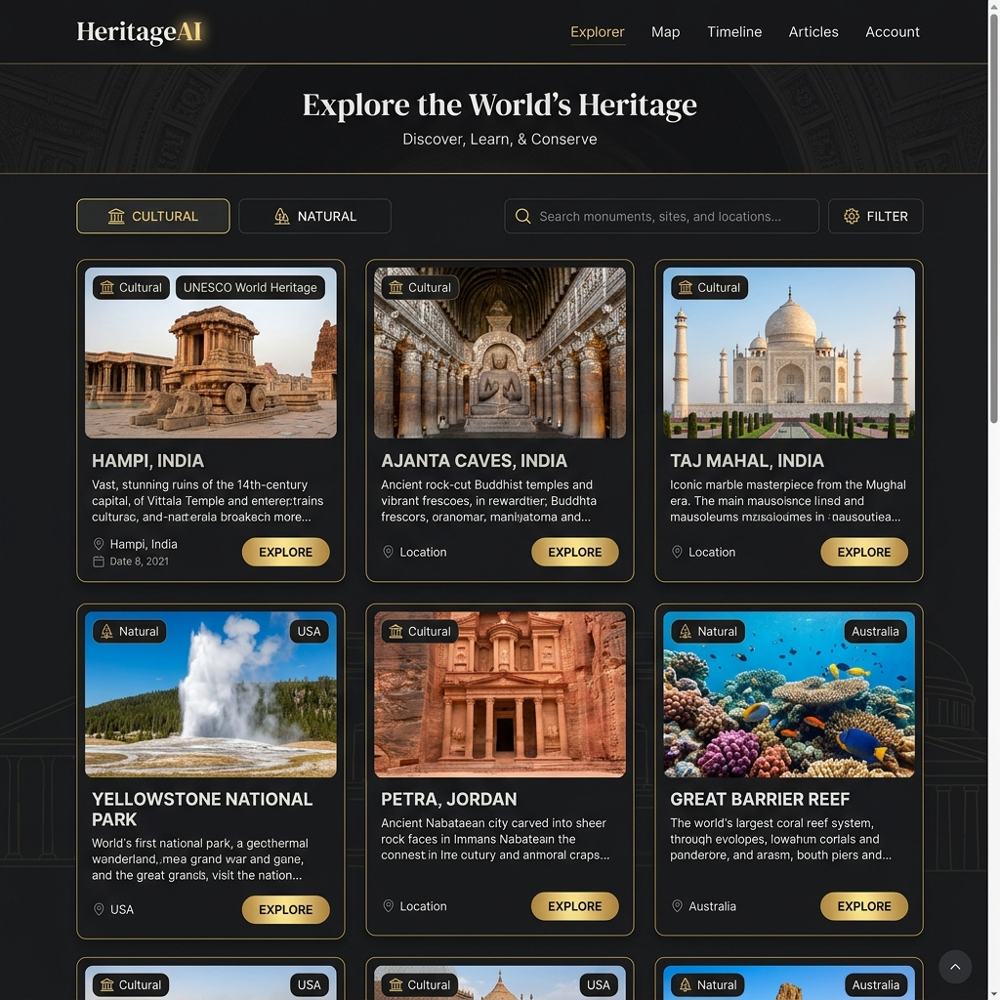
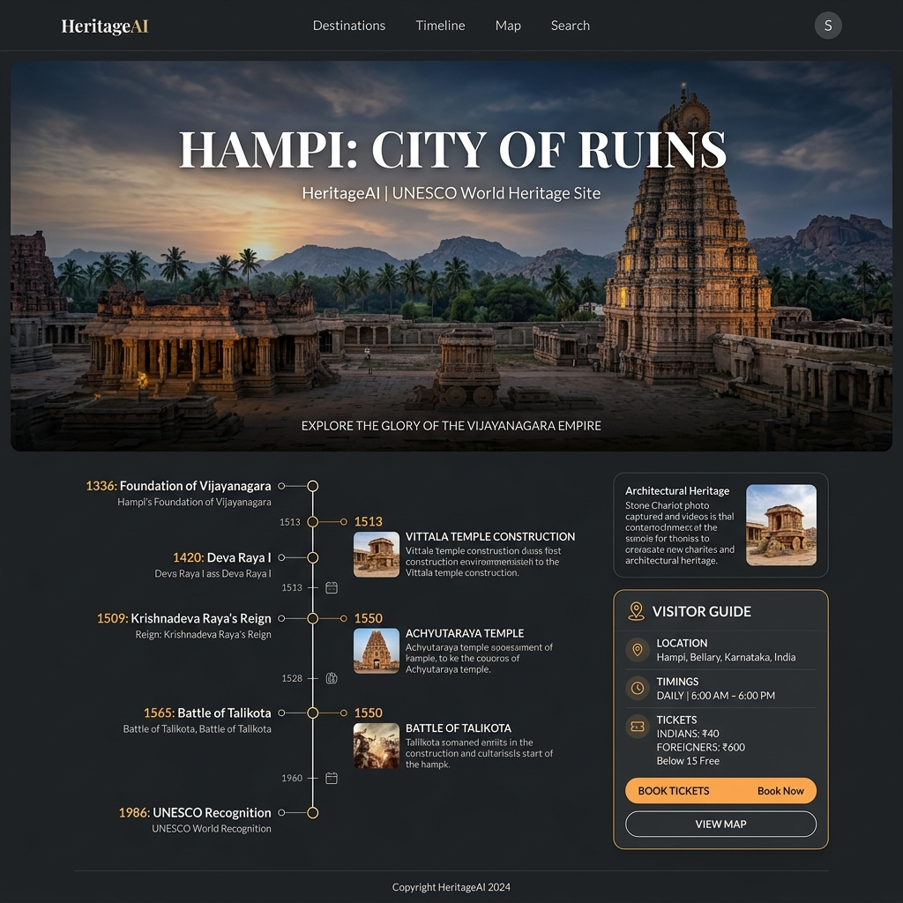
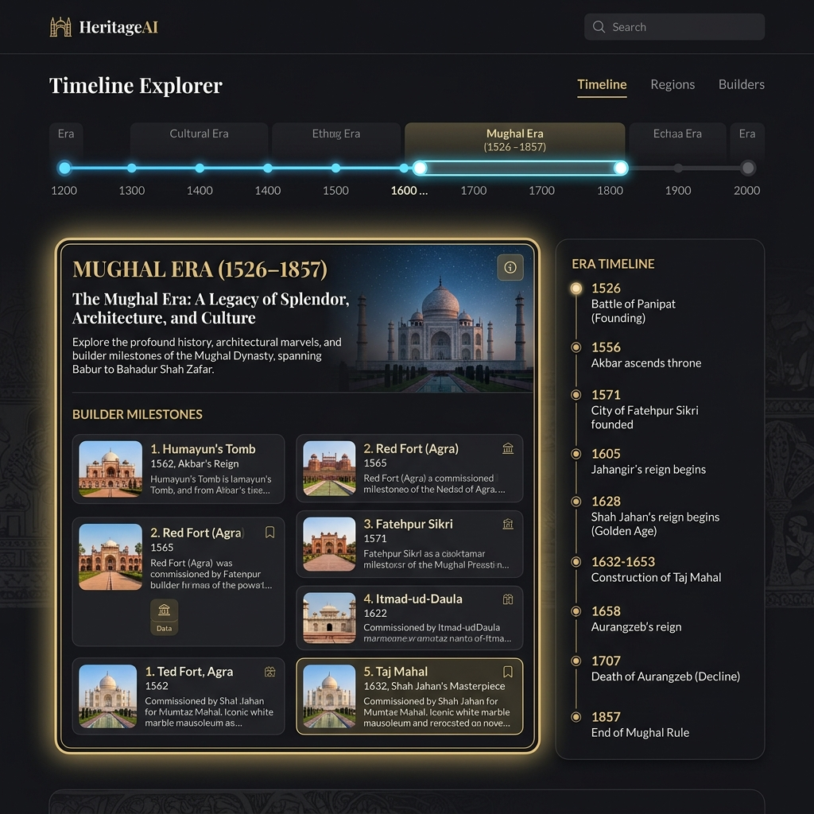
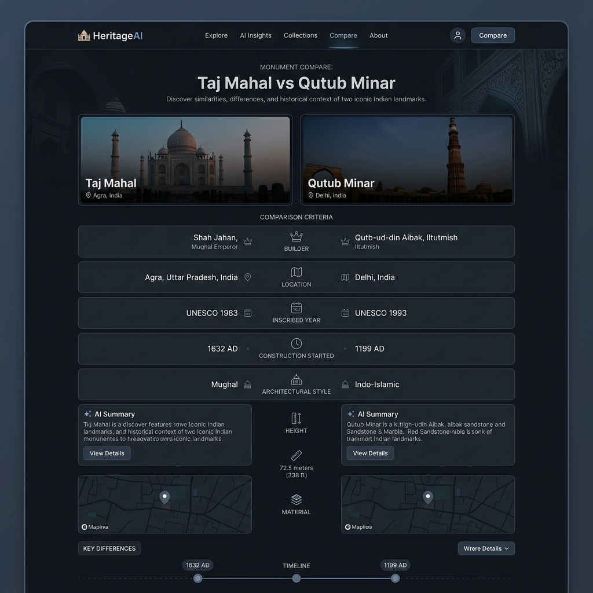
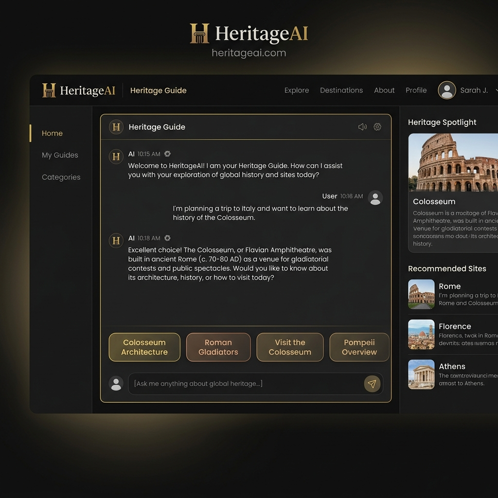
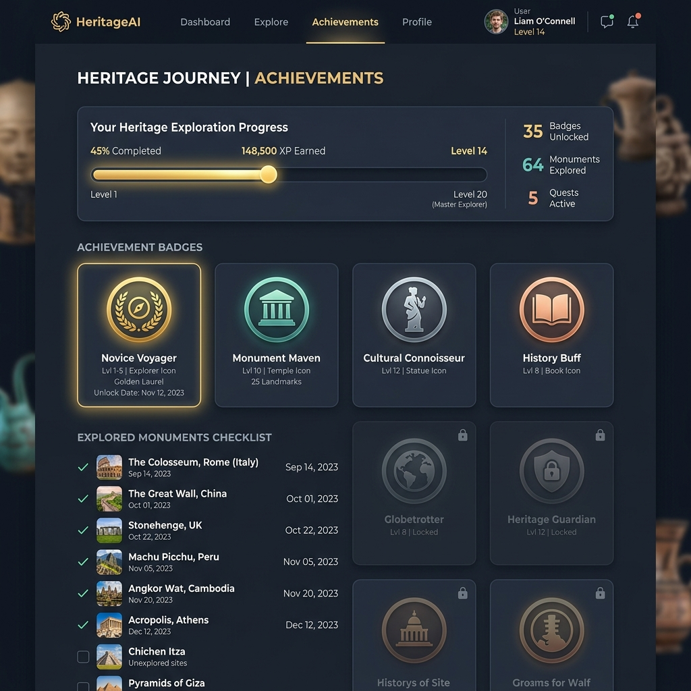

# 🏛️ HeritageAI - India's World Heritage Vault & Travel Planner

HeritageAI is a premium, high-performance, and offline-ready digital product dedicated to exploring, comparing, and tracking India's 20 iconic UNESCO World Heritage Sites. Architected using Next.js (App Router), Framer Motion, and Tailwind CSS, the application offers an immersive, interactive, and accessible user experience that bridges ancient history with modern web engineering.

HeritageAI has been upgraded from a portfolio site into a fully featured **portfolio product** suitable for recruiters, hiring managers, and technical showcases.

---

## 📸 Screenshots & Showcase

The screenshots below are located in the `/screenshots` directory and highlight the flagship features of the application:

### 1. Homepage & Digital Archive Vault
*A premium dark landing page with subtle scroll parallax, animated background glows, and interactive spotlight sites.*


### 2. Interactive Monument Explorer
*Browse all 20 monuments with a smart search bar, category tabs, and loading skeleton templates.*


### 3. Deep-Dive Chronicles & Explored System
*View key facts, architectural highlights, visitor guide schedules, nearby attractions, and mark sites as explored.*


### 4. Historical Timeline Explorer
*Drag the range slider to see monuments appear chronological through ancient, medieval, Mughal, and modern eras with active era milestones.*


### 5. Side-by-Side Monument Comparison
*Compare any two sites side-by-side. Highlights similarities and distinct attributes (builder, location, UNESCO year).*


### 6. AI assistant & Trip Planner
*Chat with a site-aware AI assistant that automatically detects context switches, or generate customized daily itineraries based on state, days, and budget.*


### 7. Achievements & Exploration Tracker
*Track your exploration progress with badges ('Novice Voyager', 'Dynastic Archivist'), completion indicators, and local storage persistence.*


---

## 🚀 Flagship Features

*   **1. Monument Comparison System**:
    *   Compare any two monuments side-by-side.
    *   Compares dynasty builder, UNESCO year inscribed, category, architectural highlights, and coordinates.
    *   Highlight differences and similarities visually with `Similar` and `Distinct` badges.
*   **2. Historical Timeline Explorer**:
    *   An interactive timeline mapping monuments from 250 BCE to the modern era.
    *   Active Era Panels describing the Ancient, Classical, Medieval, Mughal, Colonial, and Modern epochs.
    *   Highlights key era milestones dynamically as you drag the slider.
*   **3. AI Heritage Guide**:
    *   A chatbot interface designed for future Google Gemini integration.
    *   Features a flexible provider abstraction (`AIProvider`) wrapping a rich `MockAIProvider` and a production-ready `GeminiAIProvider`.
    *   **Context-Awareness**: Detects if you ask about a different monument than selected and offers to automatically switch focus.
    *   Provides dynamic suggested questions for quick exploration (architecture, legends, history).
*   **4. AI Trip Planner**:
    *   Enter state, travel duration (1-7 days), and budget tier (Budget, Mid-Range, Luxury).
    *   Generates daily itinerary schedules including timings, ticket price guidelines, and nearby highlights.
*   **5. Achievements System**:
    *   Mark sites as explored directly on the details page or in the index.
    *   Unlock milestones (e.g. natural park explorer, dynasty researcher) with persistent progress tracking saved in `localStorage`.

---

## 🛠️ Technology Stack

*   **Framework**: Next.js (App Router, Turbopack compiling engine)
*   **Core UI & Animations**: React 19, Framer Motion, Lucide Icons
*   **Styling & Typography**: Tailwind CSS, Google Fonts (Playfair Display, Plus Jakarta Sans, JetBrains Mono)
*   **AI Integration**: Provider abstraction supporting Google Gemini API
*   **Storage**: Client-Side persistent `localStorage`
*   **Quality Assurance**: TypeScript 5, ESLint 9

---

## 📦 Installation & Setup

### 1. Clone the Repository
```bash
git clone https://github.com/your-username/heritage-ai.git
cd heritage-ai
```

### 2. Install Dependencies
```bash
npm install
```

### 3. Configure Gemini API Key (Optional)
To use the live Gemini mode, create a `.env.local` file in the root directory:
```env
NEXT_PUBLIC_GEMINI_API_KEY=your_gemini_api_key_here
```
If no key is provided, the application runs on the robust `MockAIProvider` automatically.

### 4. Run the Development Server
```bash
npm run dev
```
Open [http://localhost:3000](http://localhost:3000) on your browser.

### 5. Build for Production
To run optimization compilations and perform typescript checks:
```bash
npm run build
npm run start
```

---

## 🔮 Future Scope
*   **Vector Map Upgrade**: Integration of live map clusters using React Leaflet or Google Maps JS API.
*   **Real-time Audio Tours**: Audio synthesis integration to read monument guides and legends aloud.
*   **Community Reviews & Photo Uploads**: Allow travelers to bookmark routes, upload visit photos, and review heritage attractions.
